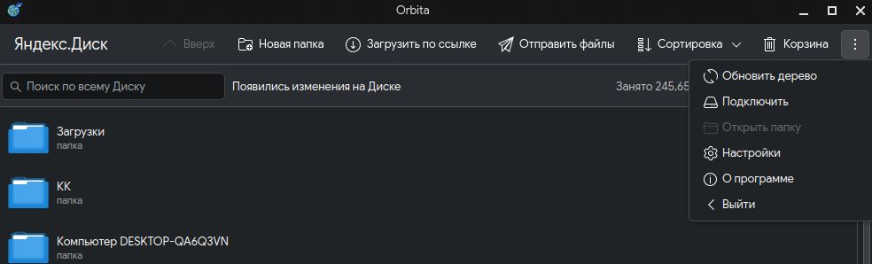
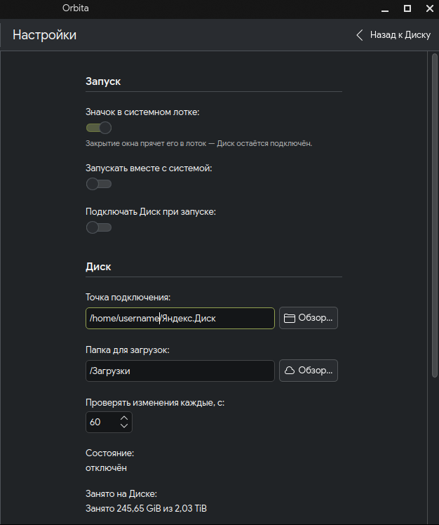
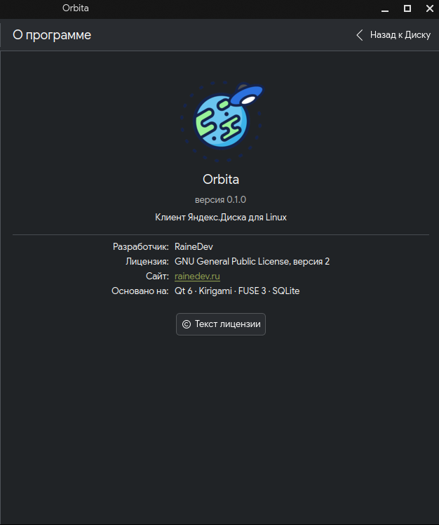
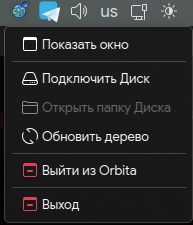
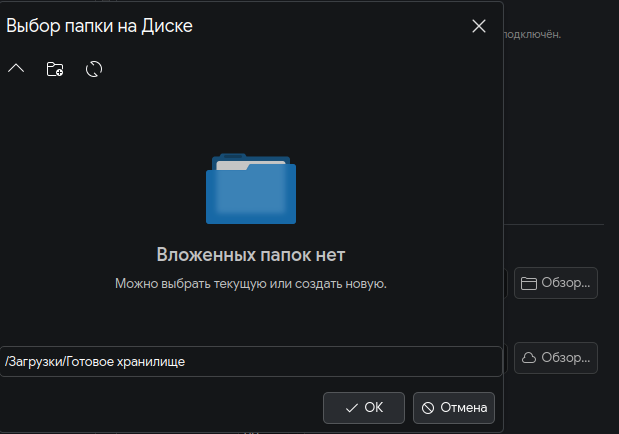
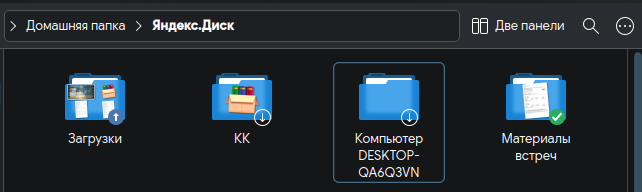
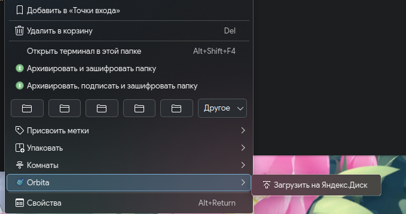
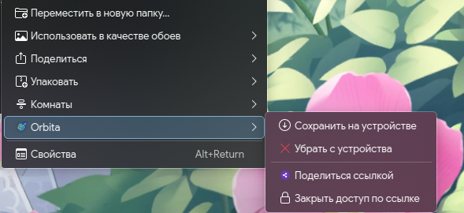

# Orbita

**A Yandex.Disk client for Linux.** [Русский](README.md)

[](https://github.com/fenixvd/Orbita/actions/workflows/build.yml)
[](LICENSE)

The official Linux client is a console daemon that does exactly one thing:
mirror the whole folder. Want to see what is on your Disk? Download all of it.
Two terabytes? Then two terabytes. There is no GUI, it has never met Wayland,
and the most recent notable news about it is that it still exists.

Orbita does what Windows has been doing for years: **the whole Disk is visible,
but only the files you actually open take up space.**



## Features

- sign in with Yandex ID from the app — no tokens in config files, no curl;
- the Disk mounts as an ordinary folder: read, write, rename, move to trash;
- **range reads** — opening a 6 GB ISO to peek at its header costs kilobytes,
  not an entire night;
- image thumbnails served by Yandex itself, so the files stay in the cloud;
- state overlays and an "Orbita" menu right inside Dolphin;
- trash with restore, public links (optionally password-protected and expiring),
  server-side copying, pinning files for offline use;
- instant search across the whole Disk, served from the local database;
- an upload retry queue: a failed upload is not lost;
- **overwrite protection**: if the file has changed on another device, your
  version is saved next to it instead of clobbering theirs;
- tray icon, desktop notifications, autostart;
- Russian and English interface.

## Screenshots

| Settings | About |
|---|---|
|  |  |

| Tray icon menu | Picking a folder on the Disk |
|---|---|
|  |  |

### Inside Dolphin

The overlay tells you where the content is: a cloud with an arrow means it
lives on the Disk only, a check mark means it is fully on this device, and
folders have an in-between state as well.



| Menu on a local folder | Menu on a file from the Disk |
|---|---|
|  |  |

## Installation

Prebuilt packages live on the
[releases page](https://github.com/fenixvd/Orbita/releases). Grab yours and:

```sh
sudo zypper install ./orbita-0.1.0-1.x86_64.rpm   # openSUSE
sudo dnf install ./orbita-0.1.0-1.x86_64.rpm      # Fedora
sudo apt install ./orbita_0.1.0_amd64.deb         # Debian, Ubuntu
```

For Arch, see `packaging/PKGBUILD`.

Restart Dolphin afterwards (`kquitapp6 dolphin`) or it will not pick up the
overlay and menu plugins.

## Building

Build dependencies:

```sh
# openSUSE
sudo zypper install gcc-c++ cmake ninja qt6-base-devel qt6-declarative-devel \
     kf6-kio-devel kf6-kstatusnotifieritem-devel fuse3-devel sqlite3-devel

# Fedora
sudo dnf install gcc-c++ cmake ninja-build qt6-qtbase-devel qt6-qtdeclarative-devel \
     kf6-kio-devel kf6-kstatusnotifieritem-devel fuse3-devel sqlite-devel

# Debian, Ubuntu
sudo apt install build-essential cmake ninja-build qt6-base-dev qt6-declarative-dev \
     libkf6kio-dev libkf6statusnotifieritem-dev libfuse3-dev libsqlite3-dev

# Arch
sudo pacman -S gcc cmake ninja qt6-base qt6-declarative kio kstatusnotifieritem \
     fuse3 sqlite
```

The build itself:

```sh
git clone https://github.com/fenixvd/Orbita.git
cd Orbita
cmake -B build -G Ninja -DCMAKE_INSTALL_PREFIX=/usr
cmake --build build
ctest --test-dir build
sudo cmake --install build
```

The prefix must be `/usr`: neither Qt nor KIO looks for plugins in
`/usr/local`. Packages are built from the same tree with
`cd build && cpack -G RPM` (or `-G DEB`).

Verified on openSUSE Tumbleweed, Fedora, Debian 13 and Arch.

## Configuration

Nothing to configure — it works right after installation.

To use your own application from oauth.yandex.ru:

```json
// ~/.config/Orbita/config.json
{ "client_id": "..." }
```

## Commands

The GUI is the main way to use Orbita. The command line is for debugging,
scripts and the file manager menu.

| Command | What it does |
|---|---|
| `orbita login` | sign in |
| `orbita doctor` | self-check: token, database, mount, plugins |
| `orbita sync` | walk the Disk and fill the metadata database |
| `orbita mount ~/Яндекс.Диск` | mount the Disk |
| `orbita mount --demo /tmp/test` | a made-up tree, no account needed |
| `orbita upload file…` | upload to the Disk |
| `orbita pin` / `unpin` | keep on this device / remove |
| `orbita share` / `unshare` | public link |

Unmount with `fusermount3 -u <mount point>`.

## How it works

```
                  ┌───────────────┐
  file        ←── │   FUSE layer  │  getattr/readdir — from the database
  manager         │  (OrbitaFuse) │  read — by range, never the whole file
                  └───────┬───────┘
                          │
          ┌───────────────┼────────────────┐
          ▼               ▼                ▼
  ┌───────────────┐ ┌────────────┐ ┌──────────────┐
  │ MetadataStore │ │CacheManager│ │   DiskApi    │
  │  tree, SQLite │ │ LRU + pin  │ │ REST + OAuth │
  └───────────────┘ └────────────┘ └──────────────┘
```

Metadata and content live apart. The entire tree sits in SQLite, so browsing
folders is instant and works offline; content is fetched on demand. A tree of
ten thousand files takes about four megabytes — roughly one photograph.

File states: `Placeholder` → `Cached` → `Pinned`, plus `Dirty` for locally
modified files.

## What not to expect

These are limits of the Yandex API, not laziness:

- **there are no change notifications.** The only way to learn that a file was
  added from your phone is to ask. Orbita asks once a minute and re-checks the
  open folder when you enter it;
- **files cannot be appended to** — editing an existing file means downloading
  it whole and uploading it back;
- **Dolphin overlays will not work in Flatpak**: the file manager runs on the
  host while the plugin would sit inside the sandbox.

## Paths

| What | Where |
|---|---|
| settings and token | `~/.config/Orbita/` |
| metadata database | `~/.local/share/Orbita/metadata.db` |
| content and thumbnail cache | `~/.cache/Orbita/` |
| mount point | `~/Яндекс.Диск` (configurable) |

## License

GNU General Public License v2 — see [LICENSE](LICENSE).

Orbita is not affiliated with Yandex. It is an independent client built on the
public [Yandex.Disk API](https://yandex.ru/dev/disk/).
